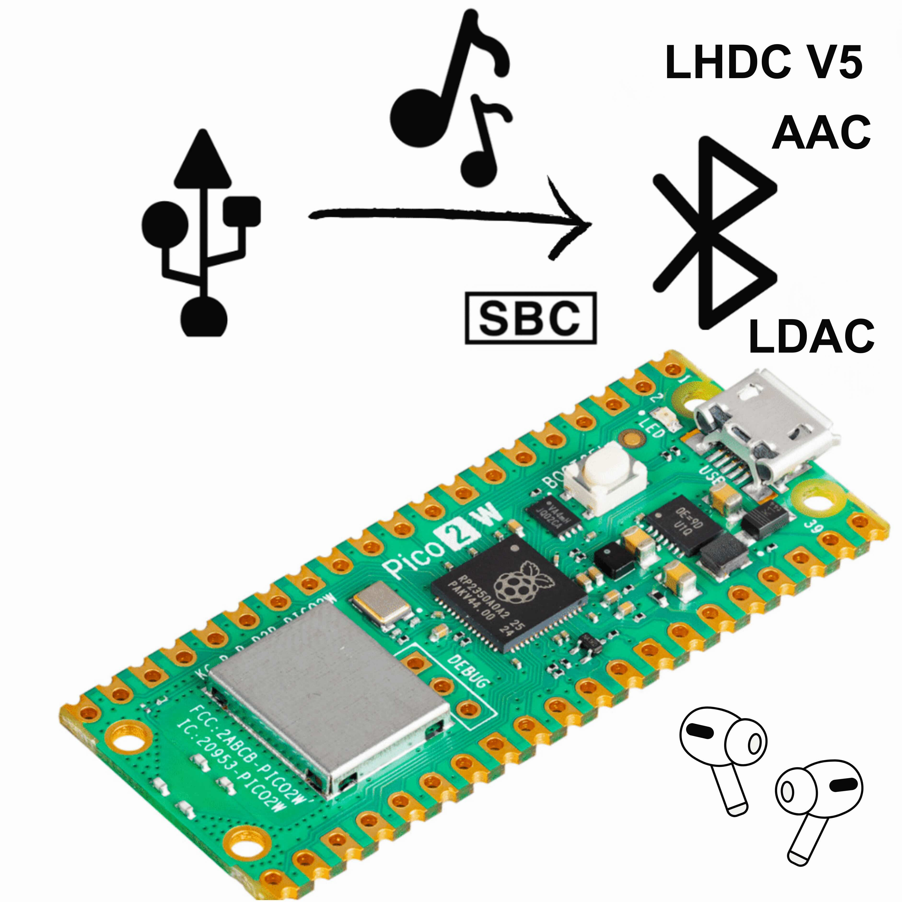

# USBPods Lite — Pico 2 W USB to Bluetooth Audio

<p align="center">

</p>

## Turn Pico 2 W into a USB to Bluetooth Aduio Streaming Dongle

**Visit USBPods webUI to control your Dongle! [hub.usbpods.com](https://hub.usbpods.com)**


Open-source firmware that turns a **Raspberry Pi Pico 2 W** (or the Waveshare
**RP2350B-Plus-W** USB dongle — one universal binary covers both) into a
driver-free USB sound card that streams to Bluetooth headphones with the
hi-res codecs ordinary dongles never ship.

Plug it into any computer, console or handheld with a USB port. No app, no
driver, no pairing dance on the host — the dongle owns the Bluetooth link, so
the host just sees a sound card.

This is the RP2350 successor of the original PicoW-usb2bt-audio project that
lived in this repo ([video demo](http://www.youtube.com/watch?v=Dilagi7l4xc)
of the original Pico W version). The RP2040 Pico W is **not** supported by
this firmware — see the older tags for that board.


## Features

- **Driver-free**: enumerates as a standard USB sound card — USB Audio Class 2,
  plus a legacy **UAC 1**, at a 48 kHz or 44.1 kHz sample rate.
- **Codecs**: SBC, AAC-LC, **AAC-ELD** (the low-latency Apple mode that makes
  AirPods sound their best), **LDAC** and **LHDC V5** — see the table below.
  Each one can be switched off so you can force the negotiation down a rung.
- **Media keys**: play/pause/skip pressed on the headset reach the computer as
  USB consumer-control keys, and absolute volume is synced both ways.
- **Two device slots** with instant switching, plus auto-connect at power-on.
- **Serial console** on the USB CDC port: the whole product UI in one
  keystroke-per-action screen, no software to install.

### Codecs

| Codec | Rates | Notes |
|---|---|---|
| SBC | joint stereo, negotiated bitpool | the A2DP baseline, always available |
| AAC-LC | CBR, up to the sink's ceiling | rate follows what the headset asks for |
| AAC-ELD | 256 kbps | AirPods low-latency mode; big latency win on Apple gear |
| LDAC | 330 / 660 / 990 kbps | retunes **live** — no reconnect to change quality |
| LHDC V5 | 256 / 400 / 500 kbps | also retunes live |

The dongle offers every enabled codec and takes the best one the headset
accepts. What actually got negotiated — and the rate it is running at right
now — is on the console's status line.

AAC-ELD is Apple's undocumented vendor codec; the wire format we reverse
engineered for it is written up in
[aac-eld-apple.md](aac-eld-apple.md) — capability bytes, the millisecond-based
RTP timestamps, and the per-frame size headers.

## Lite vs Full

This repo is the free **Lite** firmware. The **Full** firmware at **Under Development** adds:

| | Lite | Full |
|---|---|---|
| Codecs, audio pipeline, media keys | ✅ full quality | ✅ same |
| Configuration | serial console | console **+ browser UI** (WebHID/WebUSB, nothing to install) |
| Remembered headsets | 2 (the slots) | 8, assignable to either slot |
| AirPods extras over AACP | — | battery, noise-control modes, gaming latency, in-ear pause |
| Phone relay (phone audio mixed into the same headphones) | — | ✅ |
| USB connect modes (audio follows headset / auto-dial on playback) | — | ✅ |
| Firmware updates | copy a UF2 | one click in the browser |

The web UI recognizes a Lite dongle and offers the upgrade path.

## Installation

1. Download `USBPods_Pico2W_Lite.uf2` from the
   [releases page](https://github.com/wasdwasd0105/USBPods-Pico2W/releases)
   (or build it yourself, below).
2. Hold **BOOTSEL** while plugging the board in — it appears as an `RP2350`
   drive.
3. Copy the UF2 onto the drive; the board reboots into the firmware.

## Usage

1. Select the **USBPods Lite** audio output on your computer.
2. Put your headphones in pairing mode — the dongle scans and connects on its
   own. Afterwards it reconnects at power-on.
3. For anything else, open the serial console: any terminal on the USB CDC
   port, e.g. `screen /dev/tty.usbmodem*` (macOS/Linux) or PuTTY on the COM
   port (Windows). Press **Enter** for the menu.

### Console keys

| | |
|---|---|
| `Enter` `h` | show the menu (status, slots, settings) |
| `,` `.` `/` | next track · previous track · play/pause |
| `[` `]` | volume up · down |
| `c` `d` | connect · disconnect |
| `p` | **pair new earbuds** into the current slot |
| `1` `2` | switch to slot 1 / 2 (dials it if a headset is stored) |
| `l` | list the paired devices |
| `r` | forget everything (link keys and slot records) |
| `w` | auto-connect at power-on on/off |
| `u` | USB audio mode: UAC2 ⇄ UAC1 (re-enumerates) |
| `k` | USB sample rate: 48 ⇄ 44.1 kHz (re-enumerates) |
| `b` | earbud button action while connected |
| `q` | LDAC quality: 660 → 990 → 330 kbps |
| `e` | LHDC bitrate: 400 → 500 → 256 kbps |
| `5` `6` `7` `8` | enable/disable AAC-ELD · LHDC V5 · LDAC · AAC |
| `H` `D` | advanced menu · persistent debug logging |

Settings are stored in flash and survive reboots. Codec toggles apply at the
next connection — a running stream is never torn down under you. LDAC and LHDC
rate changes apply immediately, mid-stream.

In Lite each slot **owns** its headset: pairing a new device into a slot
forgets the one it replaces, link key included.

### Status LED

| Pattern | Meaning |
|---|---|
| solid | idle / connected, nothing playing |
| one blink, pause | connecting slot 1 |
| two blinks, pause | connecting slot 2 |
| fast flash | pairing scan running |
| slow flash | audio streaming |

## Building

Requirements:

- **pico-sdk 2.1.1** — the VS Code Raspberry Pi Pico extension layout under
  `~/.pico-sdk` works out of the box (or set `PICO_SDK_PATH`).
- **sdk patches** — the build refuses to configure until the local pico-sdk
  patches are applied; see [sdk-patches/README.md](sdk-patches/README.md).
  They fix BTstack/TinyUSB behaviour the firmware depends on, and a stock SDK
  silently changes wire behaviour rather than failing to compile.
- **Rust** for the LHDC V5 encoder crate, with the soft-float Cortex-M33
  target:

  rustup target add thumbv8m.main-none-eabi
```raw

Then:

```
cmake -B build -G Ninja
ninja -C build
```raw

The result is `build/USBPods_Pico2W_Lite.uf2`.


### Source layout

| Path | |
|---|---|
| `src/main.c` | boot, core assignment, main loop |
| `src/console.c` | the serial-console product UI |
| `src/settings.c` | flash-backed settings (wear-levelled append store) |
| `src/btstack/btstack_hci.c` | radio bring-up, pairing, link keys |
| `src/btstack/btstack_avdtp_source.c` | A2DP/AVRCP transport, pump, recovery |
| `src/btstack/codec/` | one file per codec + the registry that ranks them |
| `src/tinyusb/` | UAC2/UAC1 audio, CDC console, descriptors |
| `3rd-party/` | fdk-aac, libldac, LHDC V5 (Rust) |
| `sdk-patches/` | required pico-sdk patches |

Adding a codec is one file in `src/btstack/codec/` plus one line in
`codec_registry.c`; nothing else in the firmware changes.

## Contributing

Bug reports, test results with your headsets, and pull requests are welcome —
see [CONTRIBUTING.md](CONTRIBUTING.md) (note the relicensing grant, needed
because most files are shared with the commercial edition).

## Acknowledgments

This project wouldn't have been possible without the foundational work of:

1. [tinyusb uac2_headset](https://github.com/hathach/tinyusb/tree/master/examples/device/uac2_headset): TinyUSB UAC2 headset demo
2. [a2dp_source_demo](https://github.com/bluekitchen/btstack/blob/master/example/a2dp_source_demo.c): BTstack's A2DP source demo
3. [avdtp_source_test.c](https://github.com/bluekitchen/btstack/tree/v1.5.4/test/pts): BTstack audio tests (SBC, AAC, aptX, LDAC)

## License

Copyright (C) 2023-2026 wasdwasd0105

The USBPods firmware in this repository is licensed under
**GPL-3.0-only** (see [LICENSE.txt](LICENSE.txt)), with an
[additional permission under GPLv3 section 7](LICENSE-EXCEPTIONS.md)
that allows building and distributing binaries linked against the
bundled codec libraries and the Pico SDK stack. Without that exception
a GPL firmware could not legally ship with FDK-AAC inside — read it
before redistributing binaries.

The commercial **USBPods Full** firmware is a separate product by the
same copyright holder and is not covered by this license.

Bundled third-party code keeps its own licenses:

- **BTstack** — comes with the pico-sdk under BlueKitchen's license terms
  for Raspberry Pi silicon
- **TinyUSB** — MIT
- **FDK-AAC** — Fraunhofer FDK AAC Codec Library for Android license
  (`3rd-party/fdk-aac/NOTICE`; GPL-incompatible on its own, covered by
  the linking exception)
- **LHDC V5 encoder** — Apache-2.0 (AOSP-derived Rust reimplementation,
  `3rd-party/lhdcv5`)

### libldac: https://android.googlesource.com/platform/external/libldac
```
 Copyright (C) 2013 - 2016 Sony Corporation

  Licensed under the Apache License, Version 2.0 (the "License");
  you may not use this file except in compliance with the License.
  You may obtain a copy of the License at

       http://www.apache.org/licenses/LICENSE-2.0

  Unless required by applicable law or agreed to in writing, software
  distributed under the License is distributed on an "AS IS" BASIS,
  WITHOUT WARRANTIES OR CONDITIONS OF ANY KIND, either express or implied.
  See the License for the specific language governing permissions and
  limitations under the License.
```raw

NOTICE
```
---------------
 Certification
---------------
   Taking the certification process is required to use LDAC in your products.
   For the detail of certification process, see the following URL:
      https://www.sony.net/Products/LDAC/aosp/

```raw

### ldacBT: https://github.com/EHfive/ldacBT
```
 Copyright 2018-2019 Huang-Huang Bao

  Licensed under the Apache License, Version 2.0 (the "License");
  you may not use this file except in compliance with the License.
  You may obtain a copy of the License at

       http://www.apache.org/licenses/LICENSE-2.0

  Unless required by applicable law or agreed to in writing, software
  distributed under the License is distributed on an "AS IS" BASIS,
  WITHOUT WARRANTIES OR CONDITIONS OF ANY KIND, either express or implied.
  See the License for the specific language governing permissions and
  limitations under the License.
```raw

### FDK AAC: https://github.com/mstorsjo/fdk-aac
See `3rd-party/fdk-aac/NOTICE` for the Fraunhofer FDK AAC license.

```